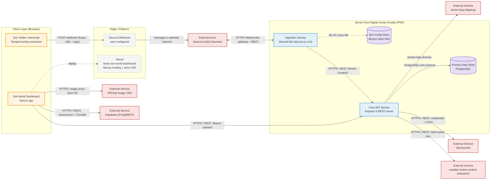

# SOS World Dashboard

A dashboard for browsing and curating VRChat worlds. Built with Next.js, React 19, and TypeScript.

## Live Sites

- **Testnet:** https://testnet.googoogaagaa.club/
- **Production:** https://sosd.googoogaagaa.club/

## Features

- Browse worlds with search, tag, platform, quality, capacity, and date-range filters
- World detail pages with ratings and community comments (Supabase-backed)
- Curated lists with import/export
- Tag browsing
- Dashboard with platform and quality stats
- English and Japanese localization
- Dark/light theme

## Tech Stack

- Next.js 16 (App Router) + React 19 + TypeScript
- TanStack Query for data fetching
- App Router for routing (client navigation via a `next/navigation` adapter)
- Tailwind CSS
- i18next (en/ja)
- Supabase (community sentiment: ratings + comments)
- Cloudflare Turnstile
- Vitest + Playwright for testing
- Deployed on Vercel

## Architecture



## Getting Started

Requires `pnpm@11.5.1`.

```bash
pnpm install
cp .env.example .env.local
pnpm dev
```

The dev server runs at http://localhost:3000.

### Environment Variables

| Variable | Description |
| --- | --- |
| `NEXT_PUBLIC_API_BASE_URL` | Backend API base URL (defaults to `http://localhost:3000`) |
| `NEXT_PUBLIC_API_BEARER_TOKEN` | Optional bearer token sent as `Authorization: Bearer ...` |
| `NEXT_PUBLIC_SUPABASE_URL` | Supabase project URL |
| `NEXT_PUBLIC_SUPABASE_PUBLISHABLE_KEY` | Supabase publishable key |
| `NEXT_PUBLIC_TURNSTILE_SITE_KEY` | Cloudflare Turnstile site key |
| `NEXT_PUBLIC_ENABLE_COMMUNITY_SENTIMENT` | Set `true` to show ratings/comments UI (default `false`) |

## Scripts

```bash
pnpm dev          # Next dev server
pnpm build        # next build (typecheck + production build)
pnpm start        # serve the production build
pnpm lint         # eslint
pnpm test         # vitest (unit)
pnpm test:e2e     # playwright (e2e)
pnpm screenshot:pr # capture a PR screenshot via Playwright
```

## Project Structure

```
src/
├── app/          # App Router entry: layout, providers, route pages, api handlers
├── api/          # fetch helpers and backend client
├── components/   # kebab-case folders with barrel exports
├── contexts/     # preference and list state providers
├── hooks/        # TanStack Query hooks and custom hooks
├── i18n/         # i18next setup with en.json / ja.json
├── lib/          # Supabase client and the navigation adapter
├── views/        # route view components (kebab-case folders with barrels)
└── types/        # shared domain types
```

## Contributing

See [CONTRIBUTING.md](CONTRIBUTING.md) for issue templates, PR conventions, and local Supabase setup.
